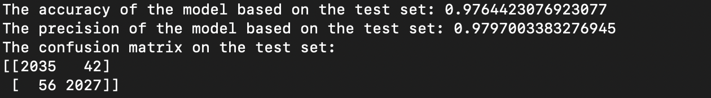

# News Articles Reliability Prediction

## Use Case

Identify which articles are authentic and which are not.

## Data

The training dataset has over 20,000 articles with fields for the article title, author, and text. The label field is the outcome variable where a 1 indicates the article is unreliable and a 0 indicates the article is reliable. The testing dataset consists of over 5000 unlabeled articles. The corresponding labels for those articles can be found in labels.csv. 

## Results

## Future Work

Here are a few things that I could try for better results:

1) Preprocessing 

   - Token Normalization (Stemming, Lemmatization)
   
   - Remove Punctuations, Unicode characters, Emojis/Emoticons (if any)
   
   - Replace Contractions
   
2) Feature Engineering

   - Type Token Ratio
   
   - Average word length, Average sentence length
   
   - POS tagging and NER
   
   - Vocabulary Size
   
   - Check for Capitalization 
   
   - Look of Mispellings (Can be an indication of fake news articles)
 
   
3) Text Representation

    - I tried Count Vectorizer and TF-IDF Vectorizer. However, there are other methods that may have worked better
    
    - Methods to try
    
        1) Word Embeddings (Word2Vec)
        
        2) Contextualized Word Embeddings (ELMo)

4) Models

    - LSTM
    
    - Pretrained Language Models (BERT Base or other variants)
    
    
5) Hyperparameter Optimization

